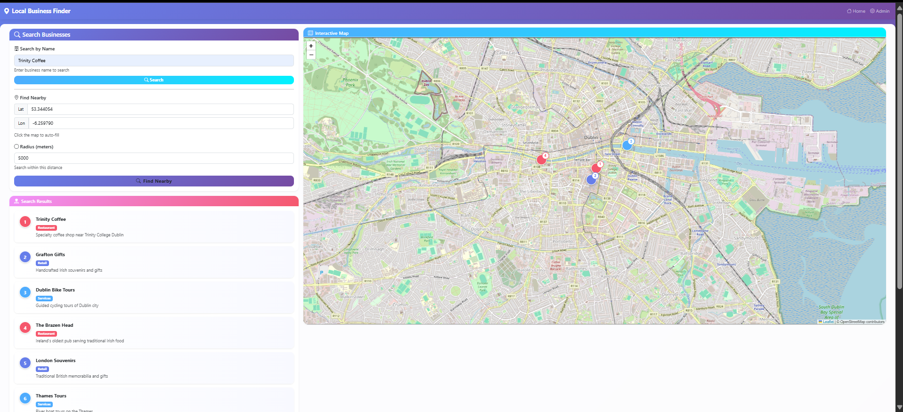
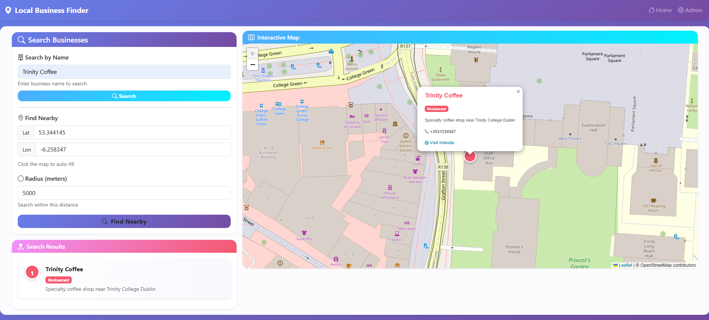
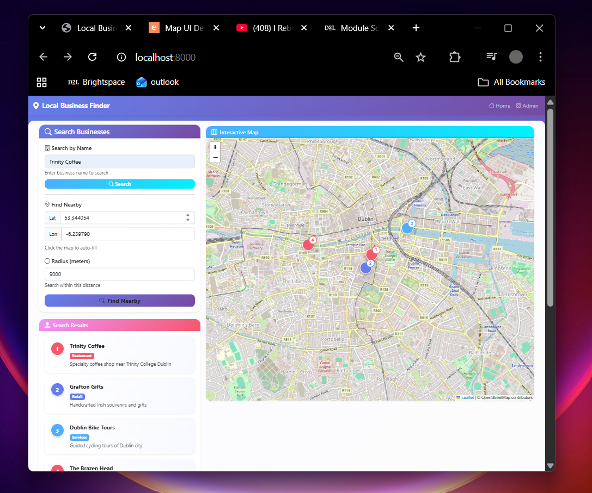
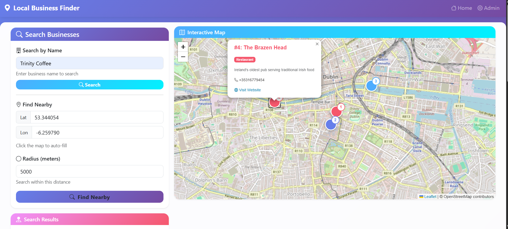

# Local Business Finder - Location-Based Services Application

## 📋 Application Description

Local Business Finder is a location-based services (LBS) web application that helps users discover businesses in their area. Built with Django, PostGIS, and Leaflet, the application provides interactive maps with advanced spatial search capabilities.

### Key Features

- **Interactive Map**: Leaflet-based map with OpenStreetMap tiles displaying business locations
- **Name Search**: Search for businesses by name or description
- **Spatial Search**: Find businesses within a specified radius
- **Category Filtering**: Filter businesses by type (Restaurants, Retail, Services)
- **Business Details**: View comprehensive information including contact details
- **Responsive Design**: Seamlessly works on desktop, tablet, and mobile devices
- **RESTful API**: Complete CRUD operations for spatial data management

## 📸 Screenshots

### Main Application Interface

*Clean, modern UI with search controls and interactive map*

### Business Search by Name

*Searching for "Trinity Coffee" returns matching businesses*

### Responsive Design

*Page shrinks to fit the screen size*

### Business Details Popup

*Clicking a marker shows detailed business information*

## 🏗️ Technology Stack

### Backend
- **Django 4.2**: Web framework implementing MVC architecture
- **Django REST Framework**: Building RESTful APIs
- **PostgreSQL + PostGIS**: Spatial database with geospatial extensions
- **psycopg2**: PostgreSQL adapter for Python

### Frontend
- **Bootstrap 5**: Responsive UI framework
- **Leaflet.js**: Interactive mapping library
- **OpenStreetMap**: Map tile provider
- **JavaScript (ES6+)**: Frontend logic

### Development Tools
- **Conda**: Python environment management
- **Git**: Version control

## 🚀 Setup Instructions

### Prerequisites

- Python 3.10+ or 3.11+
- PostgreSQL 13+ with PostGIS extension
- Git
- Conda (recommended) or pip for package management

### Local Setup

1. **Clone the Repository**
   ```bash
   git clone <your-repository-url>
   cd assignment1_setup
   ```

2. **Create Conda Environment**
   ```bash
   conda create -n lbs_app python=3.11 -y
   conda activate lbs_app
   ```

3. **Install GeoDjango Dependencies**
   ```bash
   conda install -c conda-forge gdal geos proj -y
   ```

4. **Install Python Packages**
   ```bash
   pip install -r requirements.txt
   ```

5. **Set Up PostgreSQL Database**
   ```bash
   # Connect to PostgreSQL
   psql -U postgres
   
   # Create database with PostGIS extension
   CREATE DATABASE lbs_db;
   \c lbs_db
   CREATE EXTENSION IF NOT EXISTS postgis;
   CREATE EXTENSION IF NOT EXISTS postgis_topology;
   \q
   ```

6. **Configure Environment Variables**
   ```bash
   # Copy the example file
   cp env_example.txt .env
   
   # Edit .env and update these values:
   # - SECRET_KEY (generate a new one)
   # - DB_PASSWORD (your PostgreSQL password)
   ```

7. **Run Migrations**
   ```bash
   python manage.py makemigrations
   python manage.py migrate
   ```

8. **Create Superuser (Optional)**
   ```bash
   python manage.py createsuperuser
   ```

9. **Load Sample Data**
   ```bash
   python manage.py loaddata fixtures/sample_businesses.json
   ```

10. **Run Development Server**
    ```bash
    python manage.py runserver
    ```

11. **Access the Application**
    - Main application: http://localhost:8000
    - Admin panel: http://localhost:8000/admin
    - API endpoint: http://localhost:8000/api/

### Docker Deployment (Bonus)

1. **Prerequisites**
   - Docker Desktop installed and running
   - Git

2. **Start the Application**
   ```bash
   docker-compose up -d --build
   ```

3. **Create Superuser**
   ```bash
   docker-compose exec web python manage.py createsuperuser
   ```

4. **Load Sample Data**
   ```bash
   docker-compose exec web python manage.py loaddata fixtures/sample_businesses.json
   ```

5. **Access the Application**
   - Main application: http://localhost
   - Admin panel: http://localhost/admin
   - PgAdmin: http://localhost:5050
   - API endpoint: http://localhost/api/

6. **Stop the Application**
   ```bash
   docker-compose down
   ```

### Running Tests

```bash
python manage.py test
```

## 📡 API Documentation

### Business Endpoints

#### List All Businesses
GET /api/businesses/

#### Search Businesses by Name
GET /api/businesses/?search=Trinity

#### Get Business by ID
GET /api/businesses/{id}/

#### Create New Business
POST /api/businesses/
Content-Type: application/json
{
"name": "Business Name",
"description": "Description",
"category_id": 1,
"phone": "+1234567890",
"email": "contact@business.com",
"location": {
"type": "Point",
"coordinates": [-6.2603, 53.3498]
}
}

#### Spatial Query #1: Find Businesses Within Radius
GET /api/businesses/nearby/?lat=53.3498&lon=-6.2603&radius=5000

#### Spatial Query #2: Find Nearest N Businesses
GET /api/businesses/nearest/?lat=53.3498&lon=-6.2603&limit=5


#### Spatial Query #3: Find Businesses Within Polygon
GET /api/businesses/within-area/?name=City Centre

## 🗄️ Database Schema

See `docs/schema.md` for detailed database schema documentation.

## 🧪 Spatial Queries Implemented

1. **Proximity Search** (`nearby`): Find businesses within a radius
2. **Nearest Neighbor** (`nearest`): Find N closest businesses
3. **Containment** (`within_area`): Find businesses within a polygon

## 📖 User Guide

### Finding Businesses

**By Name:**
1. Enter a business name in the search box
2. Click "Search" to find all matches
3. Click on results to navigate to them on the map

**By Location:**
1. Enter coordinates in the form, or click map to auto-fill
2. Set radius in meters
3. Click "Find Nearby"
4. View results on the map with nearest numbered
5. Click on results or markers to see details

### Adding Businesses (Admin)

1. Go to http://localhost:8000/admin/
2. Log in
3. Add business in the admin panel
4. Set location on the map

## 🐛 Known Issues & Limitations

- Requires internet for map tiles
- Large radius searches (>50km) may be slow
- No real-time updates
- Limited to stored businesses

## 🏗️ Architecture

See `docs/architecture.md` for detailed architecture diagram.

## 🔐 Security Considerations

- Environment-based configuration
- SQL injection prevention via Django ORM
- CSRF protection
- CORS configured

## 👤 Author

Patrick Doherty

## 📄 License

Educational use only.
