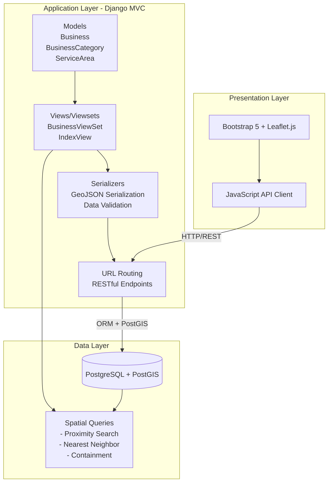

# Architecture Overview

## System Architecture

The application uses a three-tier design:

## Component Interactions

### Request Flow

1. User interaction → JavaScript API client
2. API request → Django views
3. Query → PostGIS
4. Results → GeoJSON
5. Rendering → Leaflet markers

### MVC Pattern

- **Models**: Business, BusinessCategory, ServiceArea
- **Views**: BusinessViewSet, IndexView
- **Controllers**: URL routing
