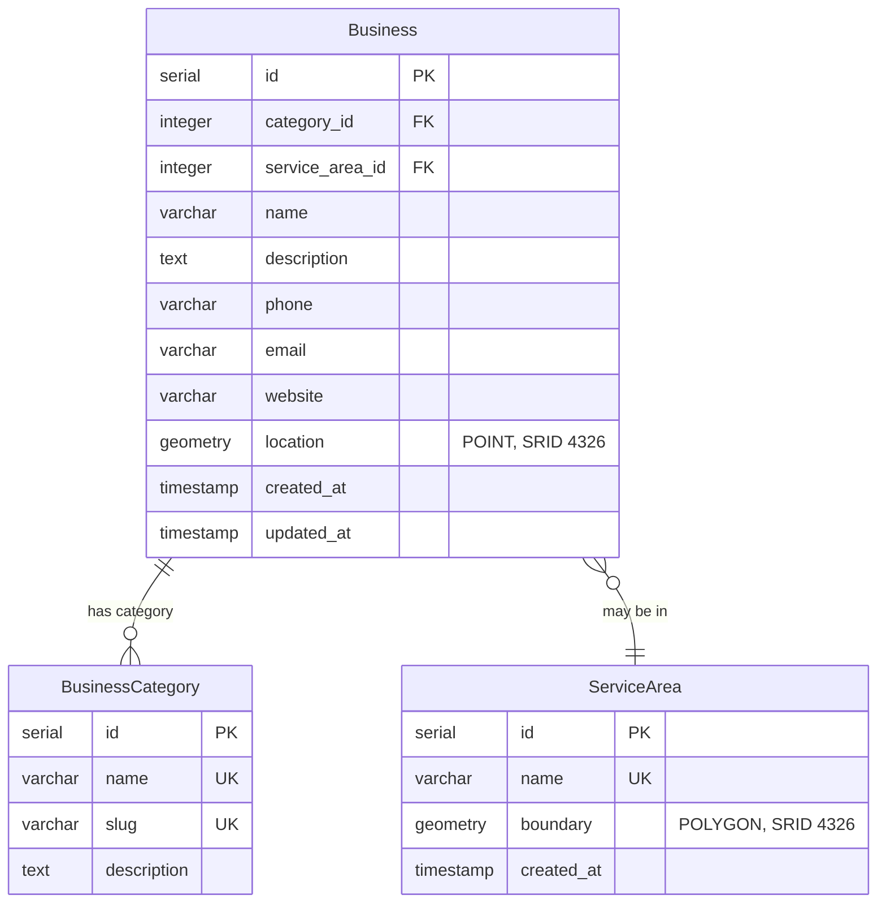

# Database Schema Documentation

## Overview

All geometries use SRID 4326 (WGS84). PostGIS spatial extensions enabled.

## Entity Relationship Diagram



## Tables

### BusinessCategory
Classification for business types.

| Column | Type | Constraints |
|--------|------|-------------|
| id | SERIAL | PRIMARY KEY |
| name | VARCHAR(100) | UNIQUE, NOT NULL |
| slug | VARCHAR(120) | UNIQUE, NOT NULL |
| description | TEXT | NULL |

### ServiceArea
Polygon boundaries.

| Column | Type | Constraints |
|--------|------|-------------|
| id | SERIAL | PRIMARY KEY |
| name | VARCHAR(150) | UNIQUE, NOT NULL |
| boundary | GEOMETRY(POLYGON, 4326) | NOT NULL |

### Business
Main business locations.

| Column | Type | Constraints |
|--------|------|-------------|
| id | SERIAL | PRIMARY KEY |
| category_id | INTEGER | FOREIGN KEY → BusinessCategory.id |
| service_area_id | INTEGER | FOREIGN KEY → ServiceArea.id, NULL |
| name | VARCHAR(200) | NOT NULL |
| description | TEXT | NULL |
| phone | VARCHAR(20) | NULL |
| email | EMAIL | NULL |
| website | URL | NULL |
| location | GEOMETRY(POINT, 4326) | NOT NULL |
| created_at | TIMESTAMP | NOT NULL |
| updated_at | TIMESTAMP | NOT NULL |

## Spatial Indexes

- **GIST index** automatically created on `Business.location` by PostGIS
- Optimizes spatial queries (proximity, nearest neighbor, containment)

## Spatial Data Types

### POINT
Used for business locations. Coordinates in [longitude, latitude] format.

Example:
```
SRID=4326;POINT(-6.2603 53.3498)
```

### POLYGON
Used for service area boundaries.

Example:
```
SRID=4326;POLYGON((-6.28 53.33, -6.18 53.33, -6.18 53.37, -6.28 53.37, -6.28 53.33))
```

## Indexes

### Business Table
- Primary key on `id`
- Index on `name`
- Index on `category_id`
- Index on `service_area_id`
- Index on `created_at` (descending)
- GIST spatial index on `location`

### BusinessCategory Table
- Primary key on `id`
- Unique constraint on `name`
- Unique constraint on `slug`

### ServiceArea Table
- Primary key on `id`
- Unique constraint on `name`